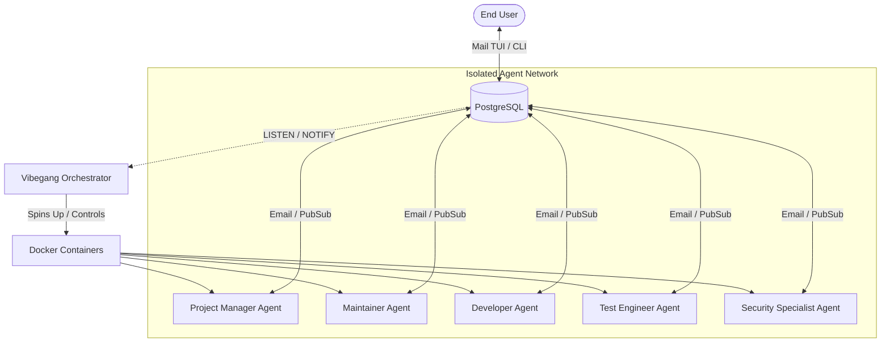

# ⚡ Vibegang: Multi-Agent Software Engineering Simulation Harness

**Disclaimer**: This project is obviously vibecoded and it's still very much a work in progress.

Vibegang is a high-performance, containerized multi-agent simulation harness designed to model a collaborative software engineering department. Using Google Genkit v1.8.0, PostgreSQL for Pub/Sub messaging, and Docker for containerized isolation, Vibegang runs simulated agents representing various corporate roles that coordinate exclusively via email and database-backed todo lists.

---

## 🏗️ Architecture Overview

Vibegang spins up an isolated, event-driven network containing a PostgreSQL instance and multiple containerized agent workers. The orchestrator tracks agent tool executions in real-time using PostgreSQL `LISTEN`/`NOTIFY`.



### Key Components

*   **Dockerized Isolation:** Every agent gets a dedicated, isolated workspace directory mapped to `/workspace` inside its container. Agent terminal commands and file edits are strictly restricted to this workspace.
*   **PostgreSQL Event Loop:** Eliminates busy-loops. Agents sleep or wait for work using PostgreSQL `LISTEN/NOTIFY` channels (`mail_events`, `log_events`), instantly waking up when they receive mail or when a task is updated.
*   **Genkit v1.8.0:** Leverages Google's Genkit framework to define tools and manage model prompts, history compactions, and LLM calls.
*   **TUI Setup & Mailbox:** Premium terminal user interfaces built using `rivo/tview` with a sleek Tokyo Night theme, allowing you to configure the team and interactively manage your mailbox (viewing, replying, and composing).

---

## ✨ Features

1.  **Tokyo Night Setup Wizard:** Interactive TUI to configure the company name, mail domain, user settings, agent roster, models, and custom system prompts.
2.  **Role-Based Agent Prompts:**
    *   **Project Manager:** Delegates developer tasks, manages project states, and monitors progress.
    *   **Maintainer:** Manages repository health and merges approved code. *Does not write new code or bug fixes; delegates them to devs.*
    *   **Developer:** Pulls, writes, compiles, tests, and pushes code to unique git branches.
    *   **Test Engineer:** Pulls developer branches, runs test suites, and flags failures.
    *   **Security Specialist:** Reviews code for vulnerabilities and approves/rejects merges.
3.  **Support for Modern LLM Backends:**
    *   Google Gemini (Google AI / Vertex AI)
    *   OpenAI
    *   Anthropic
    *   TogetherAI
4.  **Database-Backed Todo Lists:** Built-in agent tools to view, add, and mark tasks as completed (`list_todo_items`, `add_todo_item`, `remove_todo_item`).
5.  **Smart Context Auto-Compaction:** When conversation history grows beyond 200k tokens, the agent dynamically auto-compacts the history into a concise summary to optimize latency and cost.

---

## 🚀 Getting Started

### Prerequisites

*   Go 1.20+
*   Docker & Docker Compose (ensure the Docker daemon is running)
*   LLM API Keys (`GEMINI_API_KEY`, `OPENAI_API_KEY`, `ANTHROPIC_API_KEY`, `TOGETHER_API_KEY`, or `CUSTOM_API_KEY`)

### Setup and Configuration

1.  Initialize the configuration using the interactive Setup TUI:
    ```bash
    go run ./cmd/vibegang setup
    ```
    This wizard will guide you to set up your company settings, email domains, core team details, and developer/tester rosters. The results are saved to `vibegang.yaml`.

2.  Expose your LLM provider's API key on your host system:
    ```bash
    export GEMINI_API_KEY="your-gemini-key"
    # Or for Custom:
    export CUSTOM_API_KEY="your-custom-key"
    ```

    #### Custom (OpenAI-Compatible) Provider Setup
    If the model is set to `"custom"`, the harness configures a generic OpenAI-compatible backend using Genkit. You must set the following environment variables:
    *   `CUSTOM_API_KEY` (or `OPENAI_API_KEY`): API key for authentication.
    *   `CUSTOM_PROVIDER`: The provider name for Genkit (e.g. `openai`).
    *   `CUSTOM_MODEL`: The specific model identifier to target (e.g. `openai/gpt-4o`).
    *   `CUSTOM_BASE_URL`: The Base URL of the OpenAI-compatible API (e.g. `https://api.openai.com/v1`).

### Running the Harness

To start the PostgreSQL database, build the agent Docker images, and spawn the agent workers:
```bash
go run ./cmd/vibegang start -c vibegang.yaml
```

#### Database Reset Option
To clear all data tables (emails, action logs, todo lists) and restart database identity sequences from scratch before starting:
```bash
go run ./cmd/vibegang start -c vibegang.yaml --reset
```

### Interacting via Mail TUI

You can interact directly with the agent team by opening the mailbox browser to read/send emails and assign tasks:
```bash
go run ./cmd/vibegang mail -c vibegang.yaml
```

---

## 📂 Repository Structure

```
├── cmd
│   ├── vibegang            # Main CLI commands (start, setup, mail)
│   └── vibegang-agent      # Agent binary that runs inside the container
├── pkg
│   ├── agent               # Genkit initialization and built-in agent tools
│   ├── config              # Roster structure and static system prompts
│   ├── db                  # PostgreSQL database helper and event loops
│   └── orchestrator        # Docker control loop, building, and logs streaming
├── Dockerfile              # Docker recipe for the agent runtime environment
└── vibegang.yaml           # Generated team configuration
```

---

## 🛡️ Workspace & Execution Constraints

To maintain maximum safety and isolation:
*   Agents have access to a restricted terminal tool and file editors.
*   The orchestrator mounts a host directory to `/workspace` inside the agent containers.
*   Agents are explicitly instructed in their system prompts to operate **exclusively** within the `/workspace` directory when executing commands or managing files.
